### 前言

#### 项目背景

脚手架是前端工程化过程中必备的，但是开发一个脚手架的难度和成本还是很高的，需要熟悉各种node包去开发。为了降低潭州脚手架开发门槛和成本,提高开发效率，以支持潭州脚手架开发的需求。

#### 项目目标

可以基于tarn-core快速搭建脚手架工具，具备可扩展性，提效开发和维护。

### 总体方案

#### 方案结构

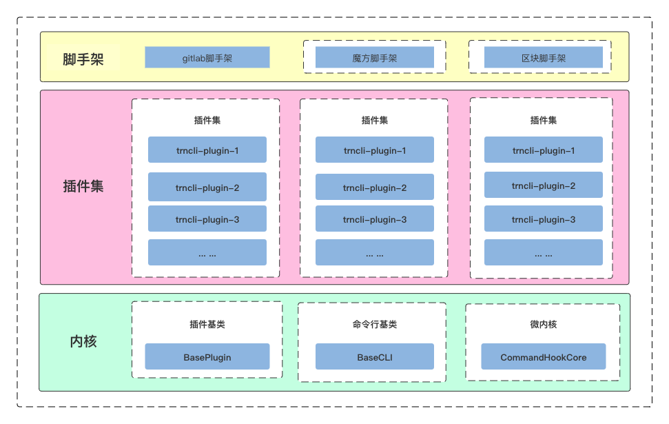

#### 核心内容

**内核：**

BasePlugin是用来开发脚手架插件的基类

BaseCli是用来开发实现终端交互脚手架命令工具的基类

CommandHookCore:

- 是一个微内核架构设计,基于此可扩展性的开发脚手架
- 支持命令通过脚手架plugin方式接入
- 支持在脚手架plugin中自定义lifecycleEvents,hooks,commands
- 支持插件/命令的安装和初始化，生命周期的转换，使用invoke()启动命令

**插件层：**

通过BaseCli构建脚手架，再配合各种独立的插件定制各种命令，最终可以构建出各种各样场景的脚手架。

# 2. 架构总览

**架构图**

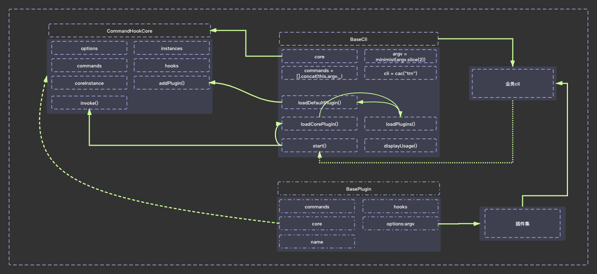

**流程图**

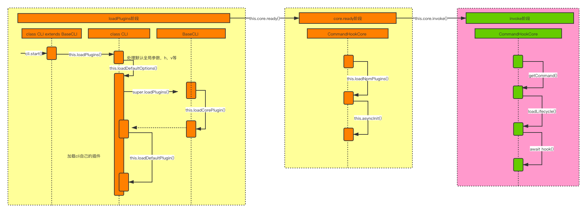

设计的核心思想：

1. 通过两个基础类开发对应的cli和plugin
2. 通过调用cli.start()启动整个脚手架的初始化，插件安装
3. 最后通过invoke()启动执行命令对应的操作
# 3. 核心流程

1. cli的loadPlugins流程

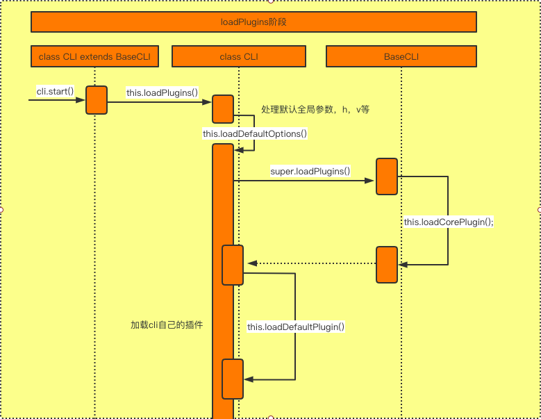

2. 插件的安装流程

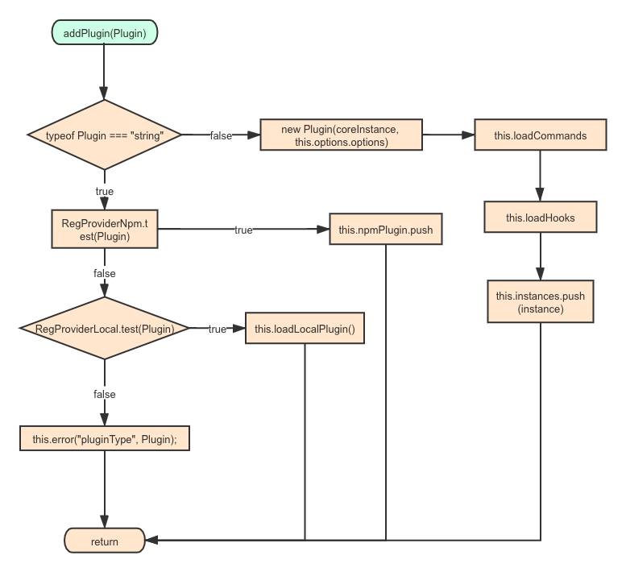

* 每一个插件的hooks都会被注入到this.core.hooks中
* 每一个插件的commands都会被添加到this.core.commands中
* 插件实例最终会被保存在this.instances中
3. core.ready的流程
* 加载npm插件
* 初始化异步插件
4. invoke流程

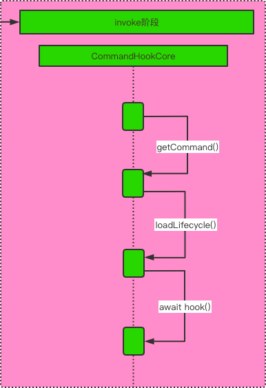

* getCommand：从this.core.commands中匹配到需要执行的command
* loadLifecycle：通过子命令和父命令构建，由当前需要执行的command的lifecycleEvents,最州生成before:command:hook,command:hook,after:command:hook三种类型的lifecycleEvents。如果有父命令，则会在前面增加parentCommand。
* 遍历lifecycleEvents,从this.core.hooks上获取对应的hook调用
# 4. 详细设计

**BaseCli:**

脚手架cli的基础类,提供cli所需要的最基础的能力,同时保持可扩展性

实例属性介绍:

```javascript
    * 初始化一个cli从new CLI(argv)开始,Cli一般是BaseCli的子类
    * argv:表示终端输入的命令行参数,通过minimist包解析
    * core: CommandHookCore的实例
    * commands:argv._的值,就是命令行输入的命令,所有不带有--/-的都是命令
    * cwd:process.cwd(),当前执行命令的所在目录
    * cli:cac的实例
```

实例方法:

```javascript
    * loadCorePlugin():加载插件的核心命令(plugin),对我们所使用的插件做增删改查等操作
    * loadDefaultPlugin():加载脚手架的默认插件,插件内核的默认插件,用户自定义的脚手架的默认插件
    * loadPlugins(): 调用loadCorePlugin和loadDefaultPlugin
    * displayUsage():展示命令帮助信息,core中调用的也是这个方法
    * start():作为脚手架的启动方法,会以此执行如下操作:
        1. loadPlugins的调用
        2. this.core.ready(),主要是做一些异步插件的初始化工作
        3. this.core.invoke():开始执行命令,从命令行参数匹配插件申明的commands,执行插件的lifecycleHooks,做对应的操作
```

**BasePlugin:**

负责管理插件的方法,所有插件都是它的子类

实例属性:

```javascript
    * core:CommandHookCore.getCoreInstance()的返回值
    * options:argv的参数,就是命令行输入出了命令之外的参数
    * commands:命令集合,每一个插件可以申明自己的commands,在addPlugin方法中会对commands做操作,最终合并到core:CommandHookCore实例的commands里面去
    * hooks:插件申明的hooks,在invoke中会通过loadLifecycle方法处理插件申明的hooks
    * name:插件的名称
```

**CommandHookCore:**

command管理和触发的类,包含了插件的安装,加载命令,加载hook,执行命令,显示help、显示version等全局提示信息

实例属性:

```javascript
    * options:
```

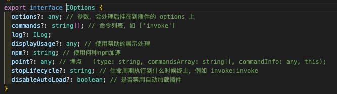

```javascript
    * instances:插件的实例对象组成的数组
```

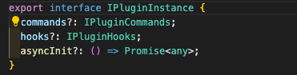

```javascript
    * commands:插件加载之后,生成的命令对象数组
```

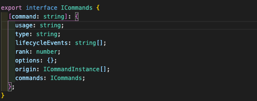

```javascript
    * hooks: 插件加载后生成的hooks对象数组
```

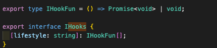

```javascript
    * coreInstance: core中提供给cli的核心api
```

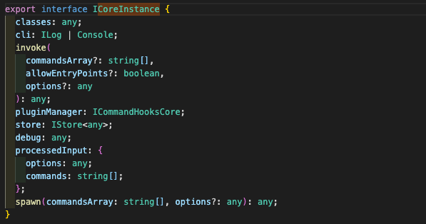

```javascript
    * npmPlugin:npm类型的插件集合
    * loadNpm:加载npm插件方法
    * preDebugTime:记录打日志前的时间戳
    * execId:日志相关的随机值
    * cac:cac实例对象
    * store:一个map对象,用来做存储
```

核心方法api:

addPlugin:

```javascript
        1. 加载插件,针对不同类型的插件进行安装和初始化
        2. 加载插件中的commands
        3. 加载插件中的hook
        4. 把当前插件实例push到instances
```

invoke:

```javascript
        1. 调用命令,可以多级调用 [invoke,local] 则执行二级子命令local
        2. 加载命令及命令下所有插件提供的hook,并按序执行hook
```

**如何快速开发一个脚手架**

```javascript
* 基于@tzfe/cli-core对外提供的BaseCli类快速创建cli
    1. 可以重新定义loadPlugins方法,制定自定义的默认加载流程,比如预先处理参数
    2. 可以自定义loadDefaultPlugin方法,加载自定义的cli插件
* 基于@tzfe/cli-core对外提供的BasePlugin类快速创建自定义cli的插件
    1. 可以定义commands和hook
    2. 也可以单独定义hook
```
# 5.架构演进规划

* **第一期**
- [x] 实现BaseCli、BasePlugin、CommandHookCore的核心逻辑
- [x] 抽离command及其options的管理
- [x] 开发scaffold插件
- [x] 开发publish插件
- [x] 开发gitlab插件
* **第二期**

第二期实现内容

* **第三期**

第三期实现内容

