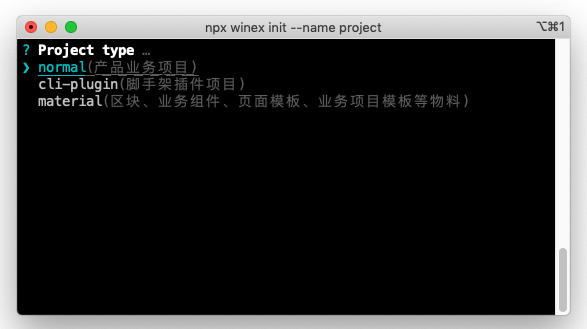
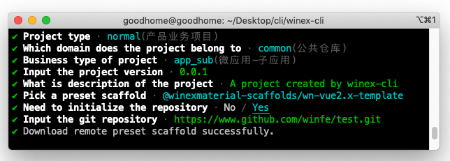
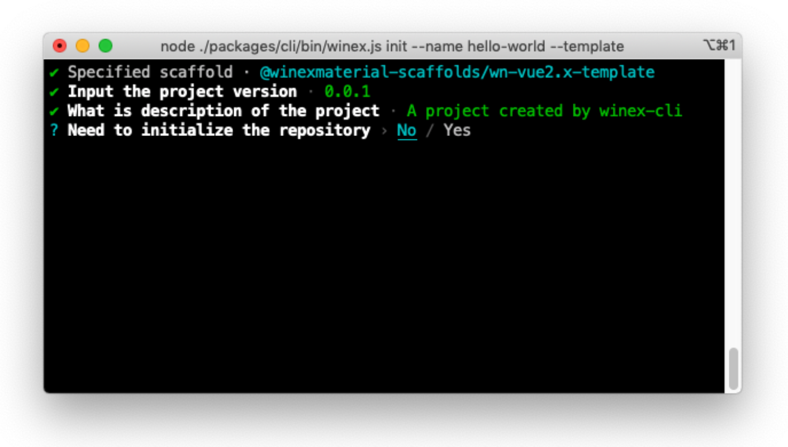
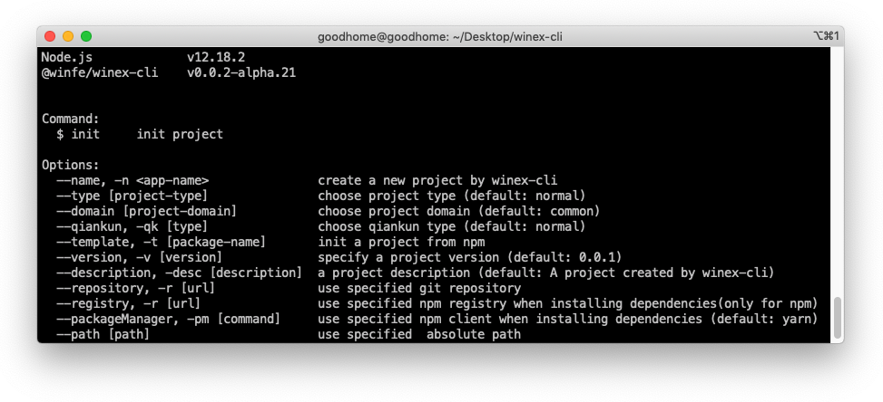

# 初始化一个项目

## winex init

运行以下命令来初始化一个新项目:

```bash
winex init --name <app-name>
```

`winex-cli`可以适用于多个项目初始化场景, 目前包括:

- 一般业务产品项目(normal)
- 脚手架插件项目(cli-plugin)
- 物料项目(material), 包括区块、业务组件、页面模板、业务项目模板等)

开发者可以根据实际情况进行选择.



### normal

#### 一般初始化流程

一般业务项目模板资源包, 通常需要对以下类别选择后完成定位:

- domain 项目所属域(详见Domains)
- qiankun 项目类型(详见Options中qiankun配置可选项)

初始化项目时, 项目的`version`与`description`选项配置, 非必填项, 默认版本为**0.0.1**, 描述为**A project created by winex-cli**. 可以根据实际需要进行修改.



模板选择完毕时, winex还会问询开发者是否需要对远程仓库进行初始化, 如需要, 则winex-cli会要求填写`repository url`, 用于关联远程仓库地址.

#### 固定项目模板
当开发者已经有明确的模板下载目标时, 可以直接指定`template`选项进行项目初始化. 以物料资源测试模板为例, 运行以下命令:

```
winex init --name hello-world --template @winexmaterial-scaffolds/wn-vue2.x-template
```


指定项目模板时, 会对模板名称进行合法性检测, 需满足以下条件:
- 有效的npm命名规则
- 有效的winning项目模板资源(包括name、version)

## Options

`winex init` 命令还有一些可选项, 可以使用`--help`指令查看具体的参数说明:



| 选项名称（option） | 缩写 | 选项说明 |  可选值 |
|---------- |-------- |-------- |-------- |
| --name | -n | 项目名称（同outdir） | - |
| --type | -   | 初始化项目的类型(普通业务项目、插件项目、物料项目及其他) | normal(默认)、cli-plugin等 |
| --domain | -   | 选择业务项目所属域 | 见Domains表详情 |
|--qiankun |	-qk	|选择初始化业务项目时，需选择业务应用类型（主应用、子应用、独立项目）	|app-indep(默认)、app-main、app-sub|
|--template |	-t	| 模板npm包名称 |	- |
|--version |	-v	| 项目版本号 |	0.0.1(默认) |
|--description |	-desc	| 项目描述 |	A project created by winex-cli(默认) |
|--repository |	-r	|项目git仓库地址	|tfs/gitlab/github等git仓库地址|
|--registry |	-	|设置npm源 |	https://registry.npmjs.org/|
|--packageManager |	-pm	| 设置node包管理工具 |	yarn(默认)/npm/cnpm|
|--path |	-	 |项目存储地址(绝对地址)	|默认为当前运行路径|

## Domains
| 域 | 含义 |
|---------- |-------- |
| common | 公共仓库 |
| finance | 费用域 |
| clinical | 临床域 |
| execution | 执行域 |
| person | 患者域 |
| encouter | 就诊域 |
| record | 记录域 |
| knowledge | 知识域 |
| material | 物品域 |
